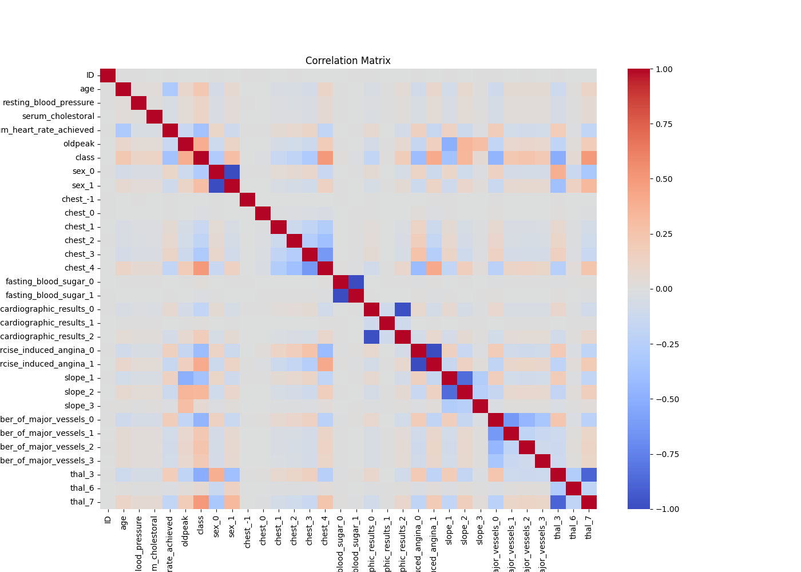
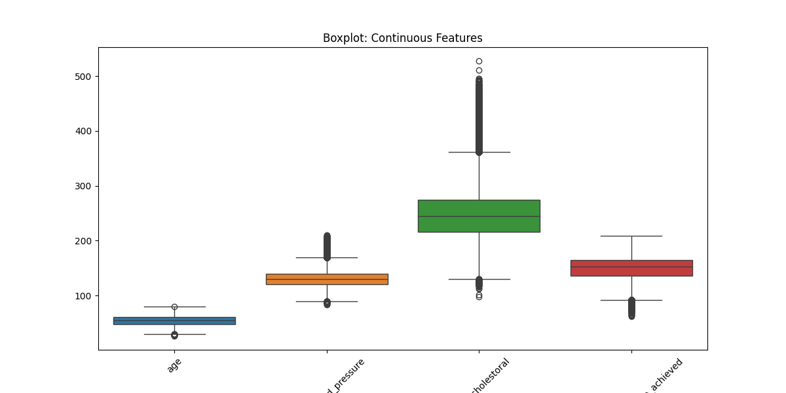

# ❤️ Heart Disease Prediction Project

## 📌 Цель проекта
Предсказать наличие сердечно-сосудистого заболевания (ССЗ) на основе медицинских признаков с помощью моделей машинного обучения и нейросетей.

## 🧬 Используемые данные
- **Обучающая выборка:** 600 000 записей
- **Тестовая выборка:** 400 000 записей
- **Признаки (13):** возраст, пол, ЭКГ, пульс, холестерин, стенокардия, oldpeak, slope, и др.

## 🔍 Анализ данных

### Корреляционная матрица


### Boxplot для выбросов


## 🧠 Обученные модели

### Logistic Regression
- Accuracy: ~0.82
- ROC-AUC: ~0.84

### Random Forest
- Accuracy: ~0.85
- ROC-AUC: ~0.88

### Нейросеть (PyTorch)
- 2 скрытых слоя: [64, 32]
- Функция активации: ReLU + Sigmoid
- Loss-график выводится по эпохам в notebook

## 🧪 Инференс
Для предсказания на тестовом наборе используется обученная модель нейросети.

```bash
python inference.py
```

## 🗂 Структура проекта

```
├── data/                # CSV файлы
├── models/              # Вес модели (.pt)
├── outputs/             # Графики и изображения
├── heart_disease_final.ipynb
├── inference.py
├── requirements.txt
└── README.md
```
